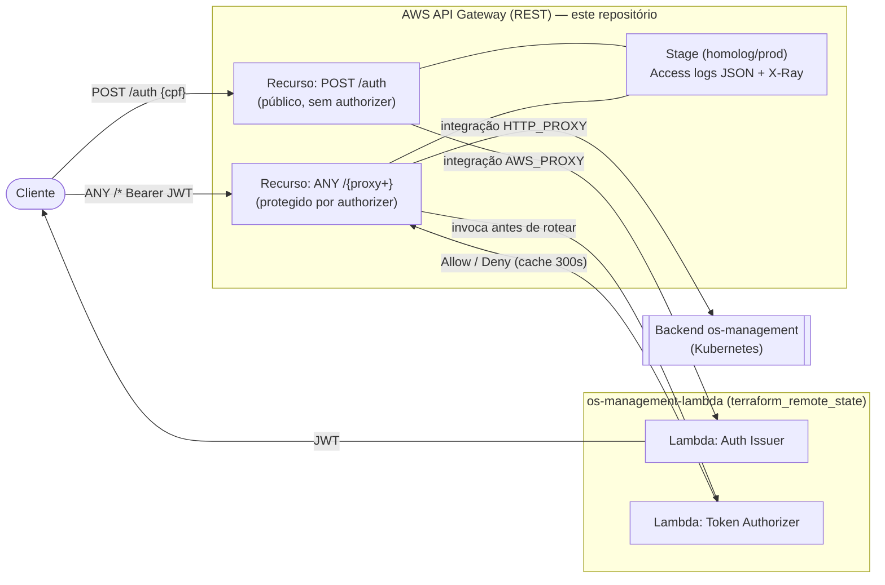

# os-management-gateway 

API Gateway da plataforma OS Management (FIAP SOAT — Tech Challenge Fase 3).

Provisiona um **AWS API Gateway (REST)** que é o ponto de entrada público da plataforma:

- **`POST /auth`** → forwarded to the **auth issuer Lambda** (public; issues a JWT from a CPF).
- **`POST /auth/login`** → forwarded to the **backend** (public; staff login by e-mail/senha,
  bypasses the authorizer just like `/auth`).
- **`ANY /{proxy+}`** → protected by a **JWT TOKEN authorizer** (the authorizer Lambda), then
  proxied to the backend application running on Kubernetes.

As funções Lambda em si vivem no repositório **`os-management-lambda`**; este repositório lê os
ARNs de invocação delas via `terraform_remote_state` e monta o gateway em torno delas.

## Arquitetura



POST /auth {cpf}                    -> API Gateway -> Issuer Lambda -> JWT (cliente)
POST /auth/login {email,senha}      -> API Gateway -> backend       -> JWT (staff)
ANY /* (Authorization: Bearer JWT)  -> API Gateway -> Authorizer Lambda (allow/deny)
                                                   -> backend (Kubernetes) if allowed
```
POST /auth {cpf}                    -> API Gateway -> Lambda Issuer -> JWT
ANY /* (Authorization: Bearer JWT)  -> API Gateway -> Lambda Authorizer (allow/deny)
                                                   -> backend (Kubernetes) se permitido
```

## Tecnologias

- AWS API Gateway (REST), AWS Lambda (referenciada), Terraform (`~> 5.0` AWS provider)
- Logs de acesso estruturados (JSON) no CloudWatch + tracing X-Ray no stage
- GitHub Actions — CI (`terraform fmt`/`validate`) e CD (push para `develop` ou `main`; o nome da branch é o ambiente)

## Referência da API (Swagger / Postman)

Não há um documento OpenAPI gerado para o próprio gateway — ele apenas adiciona `POST /auth`
e encaminha todo o resto para o backend. Use a collection da plataforma no repositório principal:

- **Bruno / Postman:** [`os-management` → `bruno/os-management-api`](https://github.com/TechChallenge-Software-Architetute/os-management/tree/develop/bruno/os-management-api)
  - [`01 - Auth / 03 - Login via CPF (Serverless)`](https://github.com/TechChallenge-Software-Architetute/os-management/tree/develop/bruno/os-management-api/01%20-%20Auth) → `POST {{gatewayUrl}}/auth`
  - `02 - Clients / 07 - My Orders`, `09/10 - Decide Order` → rotas protegidas via `{{gatewayUrl}}`
- **Swagger UI (backend):** `https://<backend>/swagger-ui/index.html`

Aponte `gatewayUrl` para o output `auth_endpoint` (removendo o `/auth` final para obter a base).

## Passos para Execução e Deploy

Pré-requisitos: o stack do `os-management-lambda` precisa estar aplicado antes (seu state
fornece os ARNs de invocação das funções), e a URL da aplicação backend precisa estar acessível.

```bash
cd terraform
cp terraform.tfvars.example terraform.tfvars   # preencha com valores reais

terraform init \
  -backend-config="bucket=<state-bucket>" \
  -backend-config="key=gateway/develop/terraform.tfstate" \
  -backend-config="region=us-east-1"

terraform apply
```

Outputs principais: `auth_endpoint`, `invoke_url`.

## Configuração do CI/CD

**Variables** do repositório: `TF_STATE_BUCKET`, `AWS_REGION`.
(`TF_STATE_BUCKET` também pode ser fornecida como secret do repositório.)

**Secrets** do repositório: `AWS_ACCESS_KEY_ID`, `AWS_SECRET_ACCESS_KEY`, `ORIGIN_URL`
(URL base da aplicação backend em Kubernetes).

Chaves de state (mesmo bucket, chaves distintas): este repositório usa `gateway/<env>/terraform.tfstate`
e lê `lambda/<env>/terraform.tfstate`.

No workflow de CD, o deploy do gateway só executa quando o state remoto do Lambda
(`lambda/<env>/terraform.tfstate`) existe no bucket; caso contrário, o job registra
um warning e finaliza sem erro para evitar falha por pré-requisito ausente.

## Ordem de Deploy

```
k8s-terraform -> database -> os-management-lambda -> os-management-gateway -> app
```

## Notes
- The `ANY /{proxy+}` route is guarded by the **JWT authorizer**, which accepts any token
  signed with the shared `JWT_SECRET` (client or staff); the **backend** then enforces roles.
  Staff log in via the public **`POST /auth/login`** on this gateway and call protected routes
  through `/{proxy+}` with their staff JWT. (The backend Swagger UI is still reached directly,
  as it is not exposed as a public gateway route.)
- Protected calls only succeed if **os-management** runs the CPF-token filter (grants
  `ROLE_CLIENT`, resolves the client by document). Deploy os-management
  `feature/cpf-auth-integration` or later.
- The authorizer keeps a 300s result cache; the authorizer Lambda returns a stage-wide Allow
  (`…/<stage>/*/*`) so caching does not break multi-route sessions.
- Access logs are JSON in CloudWatch (`/aws/apigateway/<api>-<env>/access`) with `requestId`
  for correlation with the Lambda logs.
- Remember to add the **`soat-architecture`** user to this repository.
